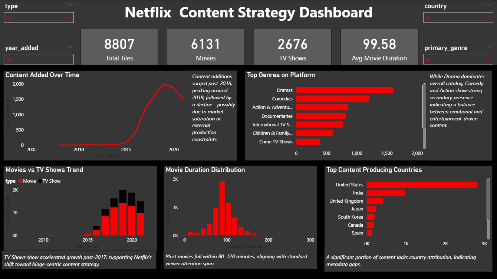

# Netflix Content Strategy Analysis
This project simulates a real-world business scenario where Netflix's content catalog is analyzed to uncover strategic trends in content production, genre distribution, geographical expansion, and viewing patterns. 

The analysis provides actionable insights that can guide:
- Content investment decisions
- Market expansion strategies
- Viewer engagement optimization

## Why This Project Matters
Streaming platforms like Netflix rely heavily on data-driven decision-making to remain competitive. Understanding patterns in content type, genre, geography, and duration helps:
- Improve user retention through binge-friendly content 
- Optimize production and acquisition budgets
- Identify high-growth markets and undeserved audiences


## Problem Statement
With increasing competition in the streaming industry, understanding content trends is critical for strategic decision-making.

This project aims to answer:
 - What type of content is Netflix focusing on over time?
 - How has content growth evolved over time?
 - Which genres dominate the platform and which are emerging?
 - Which countries are key contributors to content production?
 - What content characteristics align with viewer consumption patterns?

These insights can help guide future content production and acquisition strategies.

## Dataset
- Source: Netflix Movies and TV Shows dataset (Kaggle)
- Records: ~8,800 titles

Key Features:
- Type (Movie / TV Show)    
- Genre
- Country
- Release Year
- Date Added
- Duration

### Data Challenges
The dataset requires significant preprocessing due to:
- Missing values (director, cast, country)
- Multi-value categorical columns (genres, cast)
- Mixed formats in duration (minutes vs seasons)
- Inconsistent date formats

## Data Cleaning & Preprocessing
Key transformations performed:
- Handled missing values by imputing or labeling as 'Unknown'
- Converted ```date_added``` to datetime format
- Extracted new features:
    - ```year_added```
    - ```month_added```
    - ```primary_genre```
    - ```content_age```
- Standardized duration into numeric format (```duration_value```)
- Created bins for analyzing movie duration distribution

## Key Insights
- Content additions surged significantly after 2016, peaking around 2019, followed by a decline.
- TV Shows have grown at a faster rate than Movies, indicating a shift toward binge-driven engagement strategies.
- Drama dominates the catalog, with strong contributions from Comedy and Action genres. 
- The majority of movies fall within the 80-120 minute range, aligning with typical viewer attention spans. 
- The United States leads content production, with emerging contributions from India and the United Kingdom.

# Business Recommendations
 - Increase investment in TV Shows, especially in high-engagement genres like Crime and Thriller. 
 - Expand content production in emerging markets such as India. 
 - Maintain optimal movie durations (~90-110 minutes) to match viewer preferences. 
 - Focus on serialized content formats to improve user retention and platform engagement. 

# Dashboard Preview


# Tools & Technologies
- Python (Pandas, NumPy, Matplotlib, Seaborn)
- Power BI (Dashboard & Visualization)
- Jupyter Notebook

# Project Structure
```
netflix-content-analysis/
├── data/               # Raw & cleaned datasets
│ ├── raw/      
│ ├── cleaned/
├── notebooks/          # Analysis notebooks
│ ├── 01_data_cleaning.ipynb
│ ├── 02_analysis.ipynb
├── powerbi/            # Dashboard file
│ ├── netflix_dashboard.pbix
├── screenshots/        # Dashboard Preview
│ ├── dashboard.png
├── README.md           # Documentation
├── requirements.txt    # Dependencies
```

## Future Enhancements (Scaling the Project)
This project can be extended into a more advanced analytics solution:
1. Content Recommendation System
    - Build a recommendation engine using NLP (TF-IDF, cosine similarity)
    - Suggest similar content based on genre, cast, and description
2. Performance Analysis with External Data
    - Integrate IMBD / Rotten Tomatoes ratings
    - Analyze with genres, durations, and countries produce high-rated content
3. Predictive Modeling
    - Build a model to predict content success based on:
        - Genre
        - Duration
        - Country
        - Release timing
4. Interactive Web Application 
    - Convert dashboard into a web app using Streamlit or Flask
    - Allow users to explore trends dynamically
5. Advanced Market Analysis
    - Combine with external datasets (Google Trends, regional user data)
    - Identify high-growth markets and content gaps

## Conclusion
This project demonstrates an end-to-end data analysis workflow-from data cleaning and feature engineering to visualization and business-driven insights.

It highlights how data can be used to inform strategic decisions in a competitive, content-driven industry.